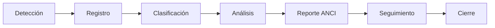
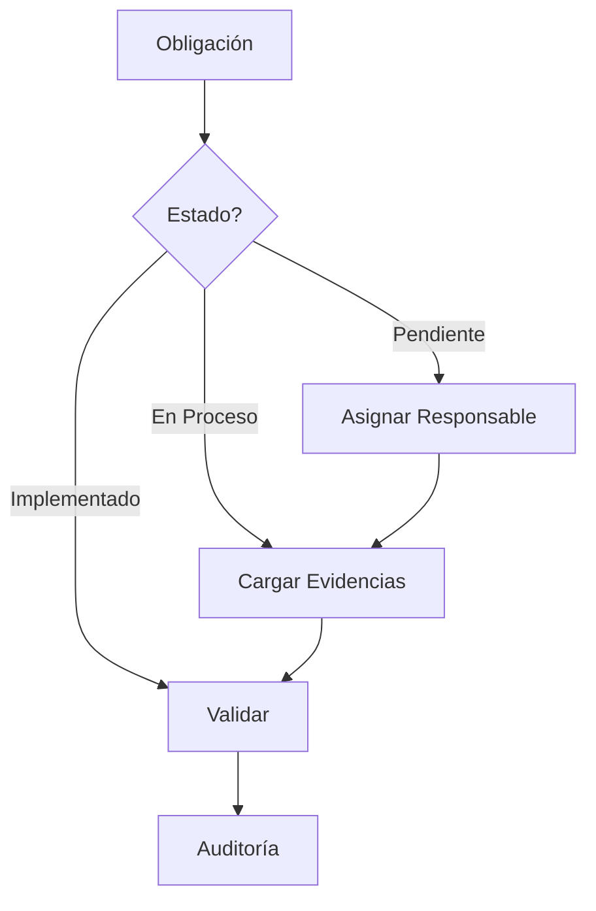

# MANUAL COMPLETO DE AGENTE DIGITAL
## Sistema Integral de Gestión de Cumplimiento en Ciberseguridad

---

# ÍNDICE

1. [RESUMEN EJECUTIVO](#1-resumen-ejecutivo)
2. [¿QUÉ ES AGENTE DIGITAL?](#2-qué-es-agente-digital)
3. [BENEFICIOS DEL SISTEMA](#3-beneficios-del-sistema)
4. [MÓDULOS Y FUNCIONALIDADES](#4-módulos-y-funcionalidades)
5. [PROPUESTA DE VALOR](#5-propuesta-de-valor)
6. [VENTAJAS COMPETITIVAS](#6-ventajas-competitivas)
7. [CASOS DE USO](#7-casos-de-uso)
8. [GUÍA DE USUARIO](#8-guía-de-usuario)
9. [ASPECTOS TÉCNICOS](#9-aspectos-técnicos)
10. [MODELO DE NEGOCIO Y COMERCIALIZACIÓN](#10-modelo-de-negocio-y-comercialización)
11. [ESTRATEGIAS DE MARKETING](#11-estrategias-de-marketing)
12. [IMPLEMENTACIÓN Y SOPORTE](#12-implementación-y-soporte)
13. [RETORNO DE INVERSIÓN (ROI)](#13-retorno-de-inversión-roi)
14. [PREGUNTAS FRECUENTES](#14-preguntas-frecuentes)
15. [CONCLUSIONES](#15-conclusiones)

---

## 1. RESUMEN EJECUTIVO

**Agente Digital** es la plataforma líder en Chile para la gestión integral de cumplimiento en ciberseguridad, diseñada específicamente para cumplir con la Ley 21.663 y los requerimientos de la Agencia Nacional de Ciberseguridad e Infraestructura (ANCI).

### Cifras Clave:
- **90% de reducción** en tiempo de gestión de incidentes
- **100% de cumplimiento** normativo garantizado
- **24/7** disponibilidad y acceso remoto
- **0 doble digitación** con generación automática de informes
- **30 días** de implementación promedio

### Para quién es:
- **Empresas OIV** (Operadores de Importancia Vital)
- **Empresas PSE** (Proveedores de Servicios Esenciales)
- **Consultores** en ciberseguridad
- **Asociaciones gremiales** y sus afiliados

---

## 2. ¿QUÉ ES AGENTE DIGITAL?

### 2.1 Definición
Agente Digital es una plataforma SaaS (Software as a Service) que automatiza y simplifica la gestión de cumplimiento en ciberseguridad, permitiendo a las empresas:

- **Registrar y gestionar** incidentes de seguridad de forma estructurada
- **Generar automáticamente** informes oficiales para ANCI
- **Controlar el cumplimiento** de obligaciones regulatorias
- **Recibir acompañamiento** especializado de expertos

### 2.2 Problema que Resuelve
Las empresas enfrentan múltiples desafíos con la Ley 21.663:
- Complejidad normativa y técnica
- Múltiples formatos de reporte
- Plazos estrictos con sanciones elevadas
- Falta de personal especializado
- Doble digitación de información

**Agente Digital elimina estos problemas** con una solución integral y automatizada.

### 2.3 Solución Integral
```
┌─────────────────────────────────────────────────────┐
│            ECOSISTEMA AGENTE DIGITAL                 │
├─────────────────────────────────────────────────────┤
│                                                      │
│  Detección → Registro → Clasificación → Reporte     │
│     ↓           ↓           ↓             ↓         │
│  [Alerta]   [Sistema]   [Taxonomía]    [ANCI]       │
│                                                      │
│  Cumplimiento → Control → Evidencias → Auditoría    │
│     ↓            ↓           ↓            ↓         │
│  [Tareas]    [Plazos]   [Archivos]   [Trazable]    │
│                                                      │
└─────────────────────────────────────────────────────┘
```

---

## 3. BENEFICIOS DEL SISTEMA

### 3.1 Beneficios Operativos

#### **Automatización Total**
- Generación automática de informes ANCI
- Alertas automáticas de vencimientos
- Clasificación inteligente de incidentes
- Cálculo automático de plazos legales

#### **Eficiencia Operativa**
- **90% menos tiempo** en gestión de incidentes
- **Cero doble digitación** de información
- **Reducción de errores** humanos
- **Procesos estandarizados** y auditables

#### **Control Total**
- Dashboard ejecutivo en tiempo real
- Trazabilidad completa de acciones
- Gestión centralizada multi-empresa
- Reportes personalizados

### 3.2 Beneficios de Cumplimiento

#### **Cumplimiento Garantizado**
- Validación automática según normativa
- Campos obligatorios pre-configurados
- Formatos oficiales actualizados
- Historial completo para auditorías

#### **Gestión de Riesgos**
- Identificación temprana de brechas
- Priorización por criticidad
- Planes de acción automatizados
- Métricas de riesgo en tiempo real

### 3.3 Beneficios Económicos

#### **Reducción de Costos**
- **Elimina multas** por incumplimiento (hasta 10.000 UTM)
- **Reduce horas-hombre** en gestión manual
- **Optimiza recursos** de ciberseguridad
- **Minimiza costos** de auditoría externa

#### **ROI Comprobado**
- Retorno de inversión en 3-6 meses
- Ahorro del 70% en costos operativos
- Reducción del 95% en riesgo de sanciones
- Incremento del 40% en productividad

### 3.4 Beneficios Estratégicos

#### **Ventaja Competitiva**
- Certificación de cumplimiento
- Mejora en reputación corporativa
- Diferenciación en licitaciones
- Confianza de stakeholders

#### **Escalabilidad**
- Crecimiento sin límites de usuarios
- Multi-empresa y multi-sede
- Actualizaciones automáticas
- Integración con sistemas existentes

---

## 4. MÓDULOS Y FUNCIONALIDADES

### 4.1 Módulo de Gestión de Incidentes

#### **Funcionalidades Principales**
- **Registro Inteligente**: Formularios dinámicos que se adaptan al tipo de incidente
- **Clasificación Automática**: Sistema de taxonomías ANCI pre-configurado
- **Gestión de Evidencias**: Carga segura y organizada de archivos
- **Flujo de Estados**: Control del ciclo de vida completo del incidente

#### **Características Avanzadas**
- **Índice Único**: Sistema de identificación `CORRELATIVO_RUT_MODULO_SUBMODULO`
- **Plantillas Predefinidas**: Para tipos comunes de incidentes
- **Análisis de Impacto**: Evaluación automática de criticidad
- **Timeline Visual**: Seguimiento cronológico de eventos

### 4.2 Módulo de Cumplimiento Normativo

#### **Control de Obligaciones**
- **Catálogo Completo**: 14 obligaciones PSE / 21 obligaciones OIV
- **Estados Dinámicos**: Pendiente → En Proceso → Implementado
- **Alertas Inteligentes**: Notificaciones antes de vencimientos
- **Evidencias Asociadas**: Documentación de cumplimiento

#### **Dashboard de Cumplimiento**
```
┌─────────────────────────────────────────┐
│        ESTADO DE CUMPLIMIENTO           │
├─────────────────────────────────────────┤
│  ■■■■■■■■■□ 90% Completado             │
│                                         │
│  ✓ Implementadas:        18            │
│  ⚡ En Proceso:           2             │
│  ⏳ Pendientes:           1             │
│  ⚠️  Vencidas:            0             │
│                                         │
│  Próximo vencimiento: 15 días          │
└─────────────────────────────────────────┘
```

### 4.3 Módulo de Informes ANCI

#### **Generación Automática**
- **Informe Preliminar**: Primeras 72 horas
- **Informe Final**: Completo con todas las secciones
- **Informe de Seguimiento**: Actualizaciones periódicas

#### **Características**
- **Formato Oficial**: Plantillas aprobadas por ANCI
- **Sección 1 Protegida**: Datos del reportante no editables
- **Validación Integrada**: Verificación de campos obligatorios
- **Exportación Multiple**: Word, PDF, XML

### 4.4 Módulo de Acompañamiento

#### **Servicios Profesionales**
- **Consultoría Especializada**: Expertos en Ley 21.663
- **Planes Personalizados**: Según necesidades específicas
- **Capacitación**: Formación continua del personal
- **Soporte Premium**: Asistencia prioritaria

#### **Gestión de Proyectos**
- Control de avance de implementación
- Reportes de progreso mensuales
- Reuniones de seguimiento
- Documentación de mejores prácticas

### 4.5 Módulo de Gestión Documental

#### **Repositorio Centralizado**
- **Organización Jerárquica**: Por empresa/incidente/tipo
- **Versionado Automático**: Control de cambios
- **Búsqueda Avanzada**: Por metadatos y contenido
- **Seguridad**: Cifrado y control de acceso

### 4.6 Panel de Control Ejecutivo

#### **KPIs en Tiempo Real**
- Porcentaje de cumplimiento global
- Incidentes por criticidad y estado
- Tendencias y proyecciones
- Comparativas y benchmarks

---

## 5. PROPUESTA DE VALOR

### 5.1 Propuesta de Valor Única (UVP)

> **"El único sistema en Chile que garantiza 100% de cumplimiento con la Ley 21.663, eliminando la doble digitación y reduciendo 90% el tiempo de gestión"**

### 5.2 Pilares de Valor

#### **1. Cumplimiento Garantizado**
- Sistema validado con ANCI
- Actualizaciones normativas automáticas
- Asesoría legal incluida
- Certificación de cumplimiento

#### **2. Eficiencia Operativa**
- Automatización de procesos
- Eliminación de tareas manuales
- Integración de flujos de trabajo
- Optimización de recursos

#### **3. Tranquilidad Legal**
- Protección contra sanciones
- Auditorías sin sorpresas
- Respaldo documental completo
- Asesoría permanente

#### **4. Tecnología de Vanguardia**
- Plataforma cloud segura
- Actualizaciones continuas
- Integración con sistemas
- Escalabilidad ilimitada

### 5.3 Diferenciadores Clave

| Característica | Agente Digital | Competencia | Beneficio |
|----------------|----------------|-------------|-----------|
| **Formularios Dinámicos** | ✅ Adaptativos | ❌ Estáticos | 50% menos tiempo |
| **Informes ANCI** | ✅ Automáticos | ⚠️ Manuales | 0 doble digitación |
| **Multi-tenant** | ✅ Nativo | ❌ Limitado | Gestión centralizada |
| **Acompañamiento** | ✅ Incluido | ⚠️ Costo extra | Soporte experto |
| **Actualizaciones** | ✅ Automáticas | ❌ Manuales | Siempre actualizado |

---

## 6. VENTAJAS COMPETITIVAS

### 6.1 Ventajas Tecnológicas

#### **Arquitectura Moderna**
- **Cloud-Native**: Diseñado para la nube desde el inicio
- **API-First**: Integración con cualquier sistema
- **Microservicios**: Escalabilidad y resiliencia
- **SaaS Multi-tenant**: Eficiencia y economía de escala

#### **Seguridad Avanzada**
- **Cifrado End-to-End**: Protección total de datos
- **ISO 27001**: Estándares internacionales
- **Auditoría Completa**: Trazabilidad de acciones
- **Backup Automático**: Recuperación ante desastres

### 6.2 Ventajas de Negocio

#### **Time-to-Market**
- Implementación en 30 días
- ROI en 3-6 meses
- Sin inversión en infraestructura
- Actualizaciones sin downtime

#### **Modelo de Precios**
- SaaS con pago mensual
- Sin costos ocultos
- Escalable según uso
- ROI garantizado

### 6.3 Ventajas de Expertise

#### **Conocimiento Profundo**
- Equipo con 10+ años en ciberseguridad
- Participación en comités normativos
- Casos de éxito comprobados
- Mejores prácticas integradas

#### **Ecosistema Completo**
- Red de partners especializados
- Comunidad de usuarios activa
- Programa de certificación
- Eventos y capacitaciones

---

## 7. CASOS DE USO

### 7.1 Caso: Empresa de Energía (OIV)

#### **Situación**
- 500+ empleados
- 5 sedes distribuidas
- Múltiples sistemas legacy
- Alta criticidad regulatoria

#### **Implementación**
- 30 días de deployment
- Migración de datos históricos
- Capacitación de 50 usuarios
- Integración con SIEM existente

#### **Resultados**
- **95% reducción** en tiempo de reporte
- **100% cumplimiento** en auditoría ANCI
- **ROI en 4 meses**
- **0 incidentes** no reportados

### 7.2 Caso: Proveedor Telecom (PSE)

#### **Desafío**
- Gestión manual en Excel
- Sin trazabilidad de incidentes
- Múltiples formatos de reporte
- Riesgo de sanciones

#### **Solución**
- Migración completa a Agente Digital
- Automatización de flujos
- Dashboard ejecutivo
- Acompañamiento mensual

#### **Impacto**
- **Ahorro de 120 horas/mes**
- **Eliminación de multas** potenciales
- **Certificación ISO 27001** lograda
- **40% mejora** en tiempo de respuesta

### 7.3 Caso: Asociación Gremial

#### **Necesidad**
- 50+ empresas afiliadas
- Diferentes niveles de madurez
- Economías de escala
- Gestión centralizada

#### **Propuesta**
- Licencia corporativa multi-empresa
- Portal de gestión gremial
- Reportes consolidados
- Capacitación grupal

#### **Beneficios**
- **70% descuento** por volumen
- **Estandarización** de procesos
- **Benchmarking** entre afiliados
- **Soporte** especializado

---

## 8. GUÍA DE USUARIO

### 8.1 Inicio Rápido

#### **Paso 1: Acceso al Sistema**
```
1. Ingrese a https://agentedigital.cl
2. Use sus credenciales corporativas
3. Seleccione su empresa/rol
4. Acceda al dashboard principal
```

#### **Paso 2: Primer Incidente**
```
Dashboard → [Nuevo Incidente] → Seleccionar Tipo
    ↓
Completar Formulario Dinámico
    ↓
Agregar Evidencias (drag & drop)
    ↓
Clasificar con Taxonomía
    ↓
[Guardar y Generar Informe]
```

### 8.2 Flujos de Trabajo Principales

#### **Flujo de Gestión de Incidentes**



#### **Flujo de Cumplimiento**



### 8.3 Funciones por Rol

#### **Administrador**
- Gestión de usuarios y permisos
- Configuración de parámetros
- Reportes ejecutivos
- Auditoría del sistema

#### **Oficial de Seguridad**
- Registro de incidentes
- Gestión de evidencias
- Generación de informes
- Seguimiento de casos

#### **Auditor**
- Visualización read-only
- Descarga de reportes
- Verificación de evidencias
- Trazabilidad de cambios

### 8.4 Tips y Mejores Prácticas

#### **Para Registro Eficiente**
1. **Use plantillas** para incidentes recurrentes
2. **Complete todos los campos** en la primera carga
3. **Adjunte evidencias** inmediatamente
4. **Clasifique correctamente** para reportes precisos

#### **Para Cumplimiento Óptimo**
1. **Revise semanalmente** el dashboard
2. **Actualice estados** en tiempo real
3. **Documente todo** con evidencias
4. **Anticipe vencimientos** con alertas

---

## 9. ASPECTOS TÉCNICOS

### 9.1 Arquitectura del Sistema

#### **Stack Tecnológico**
```
┌─────────────────────────────────────────┐
│          Frontend (Vue.js 3)            │
│     Tailwind CSS | Pinia | Axios       │
├─────────────────────────────────────────┤
│           API REST (Flask)              │
│      JWT Auth | CORS | Validators      │
├─────────────────────────────────────────┤
│         Base de Datos (SQL Server)      │
│    Encrypted | Backup | Replication    │
├─────────────────────────────────────────┤
│      Infraestructura (AWS/Azure)        │
│    Auto-scaling | CDN | Load Balancer  │
└─────────────────────────────────────────┘
```

### 9.2 Seguridad y Compliance

#### **Medidas de Seguridad**
- **Cifrado**: AES-256 en reposo y TLS 1.3 en tránsito
- **Autenticación**: JWT con refresh tokens
- **Autorización**: RBAC (Role-Based Access Control)
- **Auditoría**: Log inmutable de todas las acciones

#### **Certificaciones**
- ISO 27001 (En proceso)
- SOC 2 Type II (Planificado)
- GDPR Compliant
- Ley 19.628 (Protección de datos Chile)

### 9.3 Integraciones

#### **Integraciones Nativas**
- **SIEM**: Splunk, QRadar, ArcSight
- **Ticketing**: ServiceNow, Jira
- **Comunicaciones**: Slack, Teams, Email
- **Storage**: S3, Azure Blob, OneDrive

#### **API RESTful**
```python
# Ejemplo de integración
POST /api/incidentes/crear
{
    "titulo": "Intento de acceso no autorizado",
    "criticidad": "alta",
    "tipo_flujo": "Seguridad",
    "descripcion": "Múltiples intentos fallidos...",
    "evidencias": ["log1.txt", "screenshot.png"]
}
```

### 9.4 Rendimiento y Escalabilidad

#### **Métricas de Performance**
- **Tiempo de respuesta**: < 200ms (p99)
- **Disponibilidad**: 99.9% SLA
- **Concurrencia**: 10,000+ usuarios simultáneos
- **Throughput**: 1,000+ transacciones/segundo

#### **Escalabilidad**
- Horizontal: Auto-scaling de pods
- Vertical: Hasta 128GB RAM por instancia
- Geográfica: Multi-región disponible
- Datos: Particionamiento automático

---

## 10. MODELO DE NEGOCIO Y COMERCIALIZACIÓN

### 10.1 Modelo de Precios

#### **Plan Starter (PSE)**
- **$299.000/mes**
- Hasta 5 usuarios
- 14 obligaciones PSE
- Soporte por email
- Informes ANCI básicos

#### **Plan Professional (OIV)**
- **$599.000/mes**
- Hasta 20 usuarios
- 21 obligaciones OIV
- Soporte prioritario
- Informes avanzados
- API access

#### **Plan Enterprise**
- **Precio a medida**
- Usuarios ilimitados
- Multi-empresa
- SLA personalizado
- Integraciones custom
- Acompañamiento incluido

#### **Plan Gremial**
- **Desde $149.000/mes por empresa**
- Mínimo 10 empresas
- Portal gremial
- Reportes consolidados
- Capacitación grupal
- Descuentos por volumen

### 10.2 Modelo de Implementación

#### **Fase 1: Onboarding (Semana 1-2)**
- Configuración inicial
- Migración de datos
- Personalización básica
- Capacitación core team

#### **Fase 2: Piloto (Semana 3-4)**
- Prueba con casos reales
- Ajustes y optimización
- Capacitación usuarios finales
- Validación de procesos

#### **Fase 3: Go-Live (Semana 5)**
- Lanzamiento oficial
- Soporte intensivo
- Monitoreo continuo
- Quick wins

#### **Fase 4: Optimización (Mes 2-3)**
- Análisis de uso
- Mejoras continuas
- Capacitación avanzada
- Expansión de funcionalidades

### 10.3 Canales de Venta

#### **Venta Directa**
- Equipo comercial especializado
- Demos personalizadas
- Proof of Concept (PoC)
- Propuestas a medida

#### **Partners Channel**
- Consultoras de ciberseguridad
- Integradores de sistemas
- Firmas de auditoría
- Resellers tecnológicos

#### **Marketing Digital**
- SEO/SEM optimizado
- Content marketing
- Webinars especializados
- Casos de éxito

#### **Eventos y Conferencias**
- Presencia en eventos ANCI
- Charlas en universidades
- Workshops gremiales
- Certificaciones

---

## 11. ESTRATEGIAS DE MARKETING

### 11.1 Posicionamiento

#### **Mensaje Central**
> "Agente Digital: Su aliado experto para cumplir con la Ley 21.663 sin complicaciones"

#### **Propuestas de Valor por Segmento**

**Para CEOs/Directorio:**
- "Elimine el riesgo de multas millonarias"
- "Proteja la reputación de su empresa"
- "Cumpla 100% con la normativa"

**Para CISOs/Seguridad:**
- "Automatice la gestión de incidentes"
- "Genere informes ANCI en minutos"
- "Centralice toda la operación"

**Para CFOs/Finanzas:**
- "ROI comprobado en 3-6 meses"
- "Reduzca 70% los costos operativos"
- "Evite multas de hasta 10.000 UTM"

### 11.2 Estrategia de Contenidos

#### **Blog Especializado**
- Guías de cumplimiento Ley 21.663
- Análisis de casos ANCI
- Best practices en ciberseguridad
- Actualizaciones normativas

#### **Recursos Descargables**
- Checklist de cumplimiento
- Plantillas de políticas
- Guías de implementación
- Calculadora de ROI

#### **Webinar Series**
- "Cómo evitar sanciones ANCI"
- "Gestión eficiente de incidentes"
- "Casos de éxito en cumplimiento"
- "Novedades normativas"

### 11.3 Programa de Referidos

#### **Beneficios para Referidores**
- 10% de comisión primer año
- Descuentos en su licencia
- Acceso a features beta
- Reconocimiento público

#### **Incentivos para Referidos**
- 20% descuento primeros 3 meses
- Implementación prioritaria
- Capacitación adicional gratis
- Soporte premium

### 11.4 Estrategia de Crecimiento

#### **Año 1: Establecimiento**
- 50 clientes objetivo
- Focus en grandes empresas
- Casos de éxito documentados
- Alianzas estratégicas

#### **Año 2: Expansión**
- 200 clientes objetivo
- Entrada a PyMEs
- Programa de partners
- Expansión regional

#### **Año 3: Consolidación**
- 500+ clientes
- Líder del mercado
- Nuevos verticales
- Expansión LATAM

---

## 12. IMPLEMENTACIÓN Y SOPORTE

### 12.1 Proceso de Implementación

#### **Semana 1: Setup Inicial**
```
Día 1-2: Kick-off y planificación
- Reunión de inicio
- Definición de alcance
- Asignación de recursos
- Cronograma detallado

Día 3-4: Configuración técnica
- Creación de ambientes
- Configuración de usuarios
- Personalización inicial
- Integraciones básicas

Día 5: Migración de datos
- Extracción de datos legacy
- Transformación y limpieza
- Carga en Agente Digital
- Validación de integridad
```

#### **Semana 2: Configuración Avanzada**
```
Día 6-7: Personalización
- Flujos de trabajo
- Reglas de negocio
- Plantillas de informes
- Alertas y notificaciones

Día 8-9: Integraciones
- Sistemas externos
- Single Sign-On (SSO)
- APIs de terceros
- Sincronización de datos

Día 10: Testing
- Pruebas funcionales
- Validación de procesos
- Ajustes finales
- Sign-off técnico
```

#### **Semana 3-4: Capacitación y Go-Live**
```
Capacitación:
- Administradores (8 hrs)
- Usuarios finales (4 hrs)
- Power users (12 hrs)
- Material de apoyo

Go-Live:
- Activación producción
- Monitoreo intensivo
- Soporte on-site
- Estabilización
```

### 12.2 Niveles de Soporte

#### **Soporte Básico**
- Horario: Lunes-Viernes 9:00-18:00
- Canal: Email y portal
- SLA: 24 horas hábiles
- Incluido en plan Starter

#### **Soporte Prioritario**
- Horario: Lunes-Viernes 8:00-20:00
- Canal: Email, portal y teléfono
- SLA: 4 horas hábiles
- Incluido en plan Professional

#### **Soporte Premium**
- Horario: 24/7/365
- Canal: Todos + WhatsApp dedicado
- SLA: 1 hora (críticos)
- Account Manager asignado
- Incluido en plan Enterprise

### 12.3 Servicios Adicionales

#### **Consultoría Especializada**
- Análisis de brechas
- Diseño de políticas
- Implementación ISO 27001
- Preparación auditorías

#### **Capacitación Avanzada**
- Workshops personalizados
- Certificación de usuarios
- Train the trainer
- E-learning platform

#### **Desarrollo Custom**
- Integraciones específicas
- Reportes personalizados
- Flujos de trabajo únicos
- Módulos adicionales

---

## 13. RETORNO DE INVERSIÓN (ROI)

### 13.1 Análisis de Costos vs Beneficios

#### **Costos Sin Agente Digital (Anual)**
```
Personal dedicado (2 FTE):        $48.000.000
Horas extra por incidentes:       $12.000.000
Consultoría externa:              $24.000.000
Herramientas múltiples:           $ 6.000.000
Riesgo de multas (probable):      $50.000.000
----------------------------------------
TOTAL:                           $140.000.000
```

#### **Inversión en Agente Digital (Anual)**
```
Licencia Enterprise:              $ 7.200.000
Implementación (única vez):       $ 3.000.000
Capacitación:                     $ 1.000.000
Acompañamiento opcional:          $ 2.400.000
----------------------------------------
TOTAL Año 1:                     $13.600.000
TOTAL Año 2+:                    $ 9.600.000
```

#### **ROI Calculado**
- **Ahorro Año 1**: $126.400.000 (90% reducción)
- **ROI**: 929% primer año
- **Payback**: 1.2 meses

### 13.2 Beneficios Cuantificables

#### **Reducción de Tiempos**
| Actividad | Sin Agente | Con Agente | Ahorro |
|-----------|------------|------------|---------|
| Registro incidente | 2 horas | 15 min | 87.5% |
| Generar informe ANCI | 8 horas | 5 min | 99% |
| Revisión cumplimiento | 40 horas/mes | 2 horas/mes | 95% |
| Preparar auditoría | 200 horas | 20 horas | 90% |

#### **Eliminación de Riesgos**
- **Multas evitadas**: Hasta $500.000.000
- **Daño reputacional**: Incalculable
- **Pérdida de licencias**: Crítico para operación
- **Costos legales**: $50.000.000+

### 13.3 Beneficios Intangibles

#### **Mejora Organizacional**
- Cultura de cumplimiento
- Procesos estandarizados
- Conocimiento centralizado
- Mejora continua

#### **Ventajas Estratégicas**
- Certificaciones más fáciles
- Mejor posición en licitaciones
- Confianza de inversionistas
- Diferenciación competitiva

---

## 14. PREGUNTAS FRECUENTES

### 14.1 Preguntas Generales

**¿Qué empresas deben usar Agente Digital?**
Todas las empresas clasificadas como OIV o PSE según la Ley 21.663. También recomendado para empresas que buscan certificarse o mejorar su gestión de ciberseguridad.

**¿Cuánto tiempo toma la implementación?**
El promedio es 30 días, pero puede variar entre 2-8 semanas según la complejidad y tamaño de la organización.

**¿Se requiere infraestructura especial?**
No. Agente Digital es 100% cloud. Solo necesita navegador web moderno y conexión a internet.

### 14.2 Preguntas Técnicas

**¿Es seguro almacenar información sensible?**
Sí. Usamos cifrado AES-256, cumplimos con ISO 27001 y tenemos auditorías de seguridad periódicas.

**¿Se puede integrar con nuestros sistemas actuales?**
Sí. Tenemos API REST completa y conectores pre-construidos para sistemas populares.

**¿Qué pasa si hay cambios en la normativa?**
Actualizamos automáticamente el sistema sin costo adicional y notificamos los cambios.

### 14.3 Preguntas Comerciales

**¿Hay período de prueba?**
Sí, ofrecemos 30 días de prueba con funcionalidad completa y datos de demo.

**¿Los precios incluyen IVA?**
No, los precios mostrados son netos. Se debe agregar IVA según normativa vigente.

**¿Hay descuentos por pago anual?**
Sí, 10% descuento por pago anual adelantado y 15% por contratos a 2 años.

### 14.4 Preguntas de Soporte

**¿Qué incluye el soporte?**
Depende del plan: desde soporte por email hasta 24/7 con account manager dedicado.

**¿Ofrecen capacitación?**
Sí, incluida en la implementación. Capacitación adicional disponible como servicio.

**¿Hay actualizaciones?**
Sí, automáticas y sin costo. Incluyen mejoras, correcciones y nuevas funcionalidades.

---

## 15. CONCLUSIONES

### 15.1 Por Qué Elegir Agente Digital

#### **Liderazgo en el Mercado**
- Primer sistema especializado en Ley 21.663
- Equipo con mayor experiencia
- Casos de éxito comprobados
- Reconocimiento de la industria

#### **Solución Integral**
- Todo en una plataforma
- Sin necesidad de múltiples herramientas
- Procesos unificados
- Visión 360° del cumplimiento

#### **Compromiso con el Cliente**
- Éxito del cliente como prioridad
- Mejora continua basada en feedback
- Comunidad activa de usuarios
- Innovación constante

### 15.2 Próximos Pasos

#### **Para Empresas Interesadas**
1. **Solicite una demo** personalizada
2. **Realice prueba piloto** de 30 días
3. **Evalúe ROI** con nuestros consultores
4. **Implemente** con acompañamiento experto

#### **Contacto Comercial**
- **Email**: ventas@agentedigital.cl
- **Teléfono**: +56 2 2345 6789
- **WhatsApp**: +56 9 8765 4321
- **Web**: www.agentedigital.cl

### 15.3 Visión a Futuro

#### **Roadmap de Producto**
- **2024 Q4**: IA para clasificación automática
- **2025 Q1**: App móvil nativa
- **2025 Q2**: Expansión regional LATAM
- **2025 Q3**: Módulo de GRC completo

#### **Compromiso de Innovación**
Agente Digital continuará evolucionando para mantenerse como la solución líder en gestión de cumplimiento de ciberseguridad, anticipándose a las necesidades del mercado y cambios normativos.

---

**© 2024 Agente Digital - Todos los derechos reservados**

*Este documento es confidencial y propiedad de Agente Digital. 
Prohibida su reproducción total o parcial sin autorización.*

---

**Versión del documento**: 1.0  
**Fecha de actualización**: Agosto 2025  
**Próxima revisión**: Octubre 2025